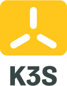
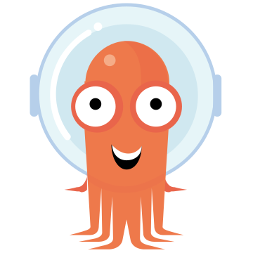

### 👋 Hi there, I'm Alex

I am a Software Engineer with a background in backend development, some frontend expertise and passionate about cloud native technologies and open source.

 

### 🧰 Toolbox

### 

 
 

### 📺 Latest Youtube Videos

<!-- YOUTUBE-VIDEOS-LIST:START -->
- [[Istio Dark Release] Frontend recommendations filter UI](https://www.youtube.com/watch?v=zqSmLRE0lIQ)
- [[Canary Release] Tekton + Argocd + Argo Rollouts + Istio](https://www.youtube.com/watch?v=HzNx88H7nxU)
- [[Java Backend] Feature 02: Song Recommendations Filters](https://www.youtube.com/watch?v=QmzbV03ACkA)
- [[Tekton] Java build pipeline](https://www.youtube.com/watch?v=Kvakrsuam3E)
- [[Hexagonal Architecture] Demo implementation](https://www.youtube.com/watch?v=eiGwvGBXFT8)
<!-- YOUTUBE-VIDEOS-LIST:END -->

🎥 [... more YouTube videos](youtubechannel)

[youtubechannel]: https://www.youtube.com/channel/UCKDLpT5eNYG1FUOsPF4zo9Q

 
 

### 📚 Reading activity

<!-- GOODREADS-READ-SHELF:START -->
- [JavaScript: The Good Parts](https://www.goodreads.com/review/show/4210637794?utm_medium=api&utm_source=rss) by Douglas Crockford. In my opinion: unrated
- [Release It!: Design and Deploy Production-Ready Software (Pragmatic Programmers)](https://www.goodreads.com/review/show/3470086928?utm_medium=api&utm_source=rss) by Michael T. Nygard. In my opinion: ⭐⭐⭐⭐⭐
- [SCJP Sun Certified Programmer for Java 6 Study Guide](https://www.goodreads.com/review/show/3411630650?utm_medium=api&utm_source=rss) by Kathy Sierra. In my opinion: ⭐⭐⭐⭐⭐
- [Head First Java](https://www.goodreads.com/review/show/3410417165?utm_medium=api&utm_source=rss) by Kathy Sierra. In my opinion: ⭐⭐⭐⭐⭐
- [Effective Java](https://www.goodreads.com/review/show/3410415783?utm_medium=api&utm_source=rss) by Joshua Bloch. In my opinion: ⭐⭐⭐⭐⭐
- [Building Microservices: Designing Fine-Grained Systems](https://www.goodreads.com/review/show/3410415970?utm_medium=api&utm_source=rss) by Sam Newman. In my opinion: ⭐⭐⭐⭐⭐
- [Java 8 in Action](https://www.goodreads.com/review/show/3410415601?utm_medium=api&utm_source=rss) by Raoul-Gabriel Urma. In my opinion: ⭐⭐⭐⭐⭐
- [The Clean Coder: A Code of Conduct for Professional Programmers](https://www.goodreads.com/review/show/3410415052?utm_medium=api&utm_source=rss) by Robert C. Martin. In my opinion: ⭐⭐⭐⭐⭐
- [Domain-Driven Design: Tackling Complexity in the Heart of Software](https://www.goodreads.com/review/show/3410413514?utm_medium=api&utm_source=rss) by Eric Evans. In my opinion: ⭐⭐⭐⭐
- [Clean Architecture](https://www.goodreads.com/review/show/3410413044?utm_medium=api&utm_source=rss) by Robert C. Martin. In my opinion: ⭐⭐⭐⭐⭐
<!-- GOODREADS-READ-SHELF:END -->

<!-- GOODREADS-CURRENTLY-SHELF:START -->
<!-- GOODREADS-CURRENTLY-SHELF:END -->
